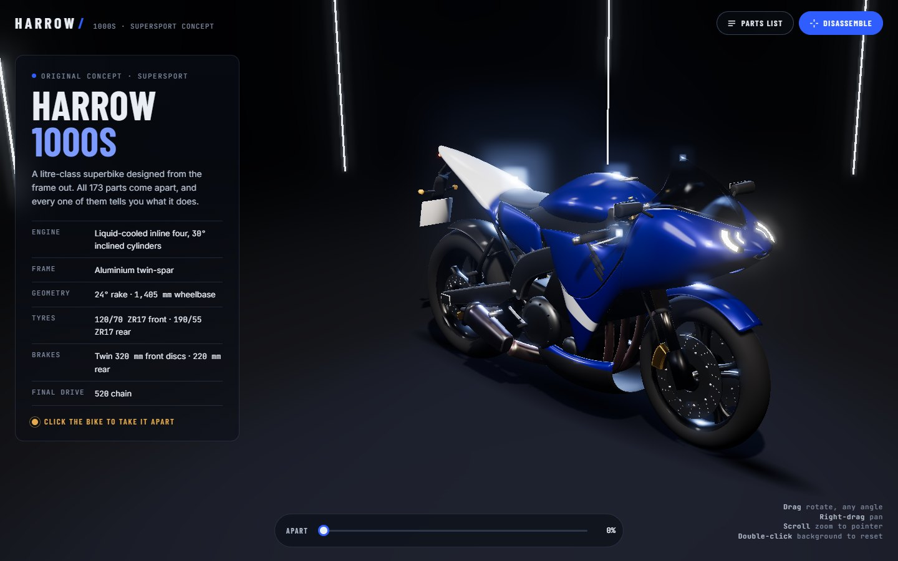
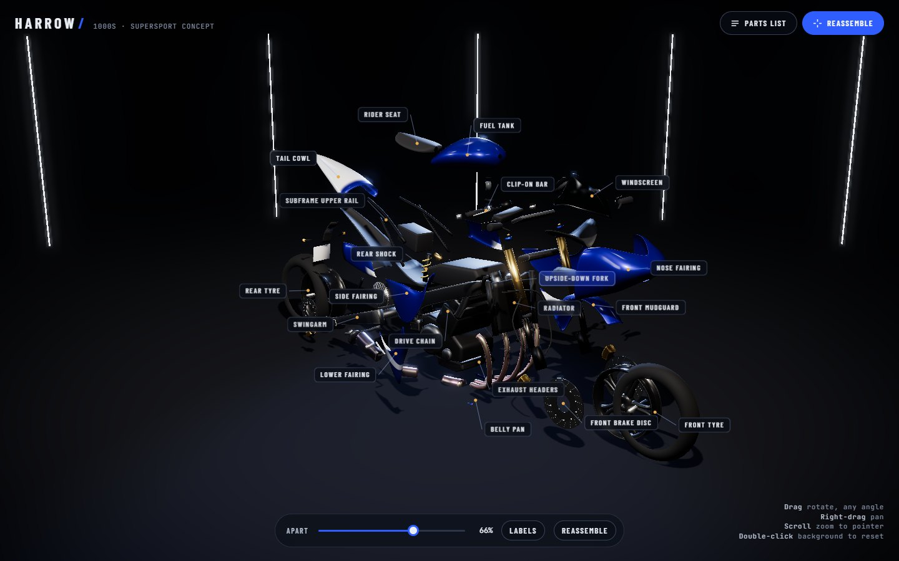
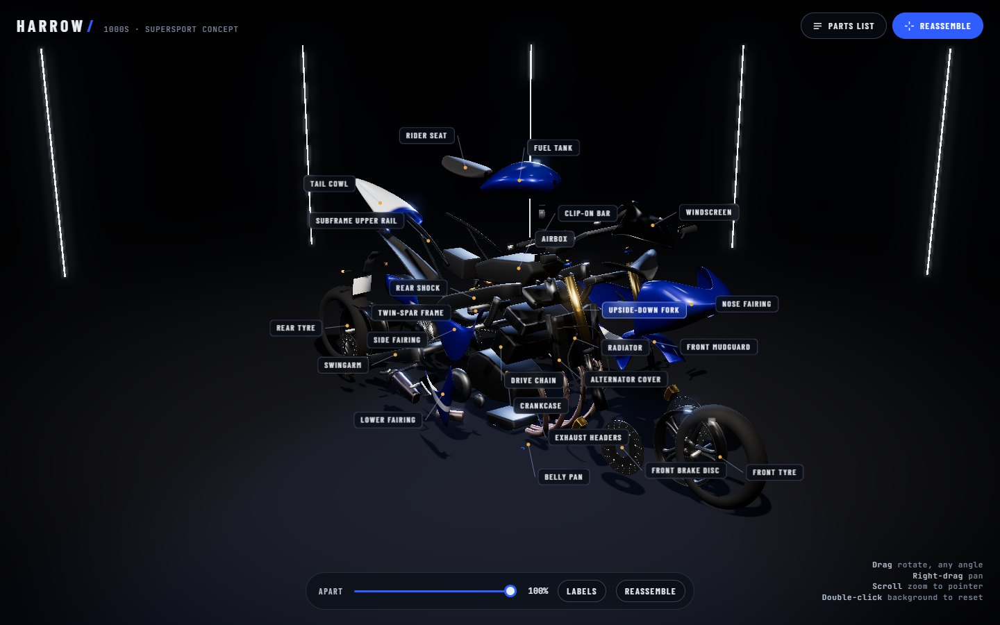
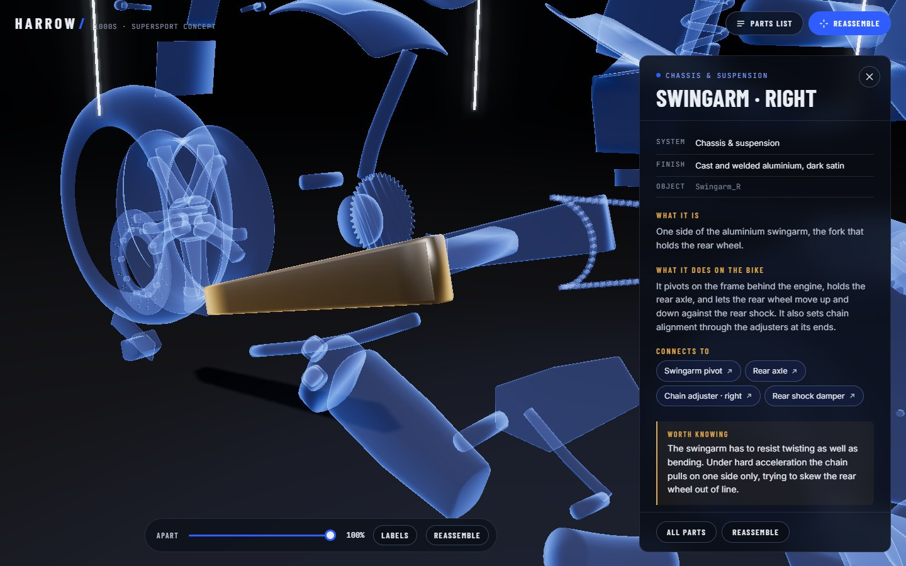
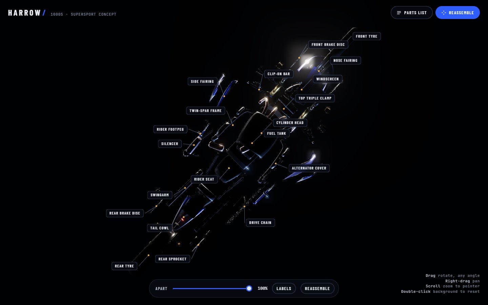
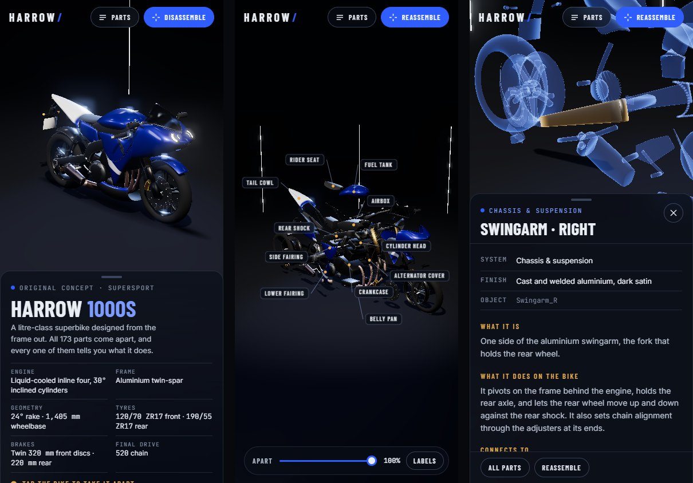

<div align="center">

# Harrow 1000S

**An original supersport motorcycle in interactive 3D. Click it and it comes apart into 173 labelled parts, each of which explains what it does.**

A single-file three.js site built from a Blender model. It reads the parts' own
custom properties to drive the exploded view, and rebuilds the custom paint
shader in GLSL so the livery stays sharp on every flying panel.

[](https://threejs.org)
[](https://www.blender.org)
[](https://www.khronos.org/gltf/)
[](https://get.webgl.org/webgl2/)
[](#quick-start)



</div>

---

## Contents

- [Why this exists](#why-this-exists)
- [Features](#features)
- [Quick start](#quick-start)
- [Screenshots](#screenshots)
- [The bike](#the-bike)
- [Exporting from Blender](#exporting-from-blender)
- [Editing part information](#editing-part-information)
- [Controls](#controls)
- [Architecture](#architecture)
- [Engineering notes](#engineering-notes)
- [What the .blend file got wrong](#what-the-blend-file-got-wrong)
- [Troubleshooting](#troubleshooting)
- [Credits](#credits)

---

## Why this exists

Most exploded-view demos are a pre-baked animation: press play and the parts
fly out along whatever path the artist keyed. You can't stop halfway, you can't
ask what a part is, and replaying it a few times usually leaves something a
millimetre out of place.

This one is **driven by the parts themselves**. Every object in the Blender file
carries a `group` and an `exploded_off` custom property. The site reads those on
load and computes each part's pose every frame from its assembled position. So
you can scrub the explosion to any percentage, reassemble it as many times as
you like with **zero drift**, and click any of the 173 parts to find out what it
does on a real supersport, in plain English.

The keyframed animation in the `.blend` file is deliberately ignored.

---

## Features

| | |
|---|---|
| 💥 **Staged exploded view** | Bodywork, screen, mirrors and lights leave first; controls, wheels and brakes next; forks, swingarm and exhaust after; engine and frame barely move. Reassembly runs it in reverse. |
| 🏷️ **Live part labels** | About 30 key parts get a callout that fades in as that part separates, with collision culling so labels never stack |
| 🔍 **Part detail panel** | What it is, what it does, its finish, what it connects to (clickable), and a real-world fact |
| 👻 **Ghost-blue focus** | Selecting a part fades everything else to an additive X-ray blue and flies the camera to frame it |
| 🎨 **Livery rebuilt in GLSL** | The Blender paint shader, ported node-for-node: metallic racing blue, white swoosh rising toward the rear, white tail top, black below 0.27 m |
| 🌀 **Orbit from any angle** | Full orbit including over the top and underneath, pan, and scroll-to-zoom toward the pointer |
| 🎚️ **Scrub slider** | Drag the explosion anywhere from 0 to 100% apart; the camera keeps everything in frame |
| 📋 **Searchable parts list** | All 173 parts grouped by system, filterable by name, system or material |
| 📱 **Responsive** | Panels become bottom sheets on phones; taps replace hover |
| ♿ **Accessible** | Keyboard-reachable controls, visible focus, Esc closes panels, `prefers-reduced-motion` respected, screen-reader announcements |
| ⚡ **Light** | One HTML file plus a 1 MB Draco model, with automatic fallback to the uncompressed GLB |

---

## Quick start

There is no build step. Serve the folder with any static server:

```bash
python -m http.server
```

Open <http://localhost:8000>.

> [!IMPORTANT]
> Opening `index.html` straight from disk won't work. Browsers block model
> loading from `file://` URLs. The page detects this and tells you to start a
> server.

three.js 0.160.0 and the Draco decoder load from jsDelivr, and the fonts load
from Google Fonts, so the first load needs an internet connection.

---

## Screenshots

<table>
<tr>
<td width="50%" align="center">
<br/>
<sub><b>Mid-disassembly</b><br/>Bodywork labels are in; frame and engine labels arrive later</sub>
</td>
<td width="50%" align="center">
<br/>
<sub><b>Fully apart</b><br/>Overlapping labels are skipped, not stacked</sub>
</td>
</tr>
<tr>
<td width="50%" align="center">
<br/>
<sub><b>Part detail</b><br/>Everything else turns ghost blue; the camera frames the part</sub>
</td>
<td width="50%" align="center">
<br/>
<sub><b>From underneath</b><br/>The one-sided floor disappears when you orbit below it</sub>
</td>
</tr>
</table>

<p align="center">
<br/>
<sub><b>At 390 px</b>: panels become bottom sheets and labels thin out to fit</sub>
</p>

---

## The bike

The **Harrow 1000S** is an original, unbranded concept.

| | |
|---|---|
| Engine | Liquid-cooled inline four, 30° inclined cylinders |
| Frame | Aluminium twin-spar |
| Geometry | 24° rake · 1,405 mm wheelbase |
| Tyres | 120/70 ZR17 front · 190/55 ZR17 rear |
| Brakes | Twin 320 mm front discs · 220 mm rear |
| Final drive | 520 chain |

### The model

| | |
|---|---|
| Parts | **173** separate mesh objects, all in the `Bike` collection |
| Custom properties | `group` (one of 22 categories), `exploded_off` (Z-up offset), `side` |
| Materials | 36, rebuilt as `MeshPhysicalMaterial` from their Blender values |
| Axes | +X forward, +Y left, Z up. Front axle (0.70, 0, 0.30), rear axle (−0.705, 0, 0.32) |
| Model size | 0.97 MB Draco / 4.7 MB uncompressed |

### How the parts come apart

| Stage | Groups | Leaves |
|:---:|---|---|
| 0 | fairing, tank, seat, tail, fender, cockpit | first |
| 1 | controls, pegs, front/rear wheel, front/rear brake | second |
| 2 | front fork, swingarm, exhaust, steering, shock, subframe, drive, radiator | third |
| 3 | engine, frame | last, and move least |

Each part also gets a small tumble from a seeded random generator (so it's the
same every time). Wheels, discs and sprockets spin about their axle instead.

---

## Exporting from Blender

Browsers can't read `.blend` files, so the model is exported to GLB:

```bash
blender -b bike.blend --python export.py
```

This writes `assets/bike-draco.glb` (loaded first) and `assets/bike.glb` (the
fallback). The script:

- sets the scene to the **last frame** of the timeline, which is the assembled pose;
- exports only the **Bike** collection (the Studio collection's floor, walls, lights and camera are skipped);
- writes GLB, +Y up, with modifiers applied and custom properties included as extras, and no cameras, lights or animations.

> [!WARNING]
> `export_current_frame=True` is essential. Without it, Blender's glTF exporter
> samples frame 0 of the keyframed animation, which is the **exploded** pose,
> even when the playhead is on the last frame.

<details>
<summary><b>Exporting by hand instead</b></summary>

File > Export > glTF 2.0, after moving the playhead to the last frame (170):

- Include: **Selected Objects** (select the Bike collection's objects first), **Custom Properties** on; Cameras and Punctual Lights off
- Transform: **+Y Up** on
- Data > Mesh: **Apply Modifiers** on; Attributes off
- Animation: **off**. Also turn on "Use Current Frame" (it may be labelled "Export current frame")
- Format **glTF Binary (.glb)**, saved as `assets/bike.glb`
- For the compressed copy, export again with **Compression** on and save as `assets/bike-draco.glb`

</details>

---

## Editing part information

All of the content lives near the top of the `<script type="module">` in
`index.html`:

| Object | What it holds |
|---|---|
| `PARTS` | 126 entries keyed by object name with the `_L`/`_R` side and trailing index removed (`FrontDisc_L` → `FrontDisc`, `Exhaust_Header3` → `Exhaust_Header`). Fields: `displayName`, `system`, `material`, `whatItIs`, `function`, `connectsTo[]`, optional `fact`. A key with a side (`Lever_L`, `FootLever_R`) overrides the shared entry for that one object. |
| `GROUP_INFO` | Group-level fallback text, so a new object with no entry still shows a complete panel |
| `GROUPS` | Maps each `group` property to a system name and an explode stage |
| `LABEL_KEYS` / `LABEL_TEXT` | Which parts get a callout label in the exploded view |
| `MATDEF` / `MAT_LABEL` | Material look (linear colour, metalness, roughness, clear coat…) and its readable finish name |
| `OFFSET_FIX` / `NAME_FIX` | Corrections for data in the `.blend` file (see [below](#what-the-blend-file-got-wrong)) |

`connectsTo` entries use the same key form. A paired key resolves to the same
side as the part you're viewing.

### Checking the data

Open the browser console and run:

```js
harrow.audit()   // [] means every part has its own content and every link resolves
harrow.drift()   // largest distance between any part and its assembled pose
```

Both currently return clean results: an empty list and `0`.

---

## Controls

| Input | Action |
|---|---|
| Left-drag | Orbit from any angle: all the way round, over the top and underneath |
| Right-drag | Pan |
| Scroll | Zoom toward whatever is under the pointer |
| Double-click background | Reset to a framed view for the current state |
| Click the bike | Take it apart |
| Click a part or its label | Open its details |
| Click empty space / `Esc` | Close the detail panel or the parts list |
| **Apart** slider | Scrub the explosion from 0 to 100% |
| **Labels** | Toggle the exploded-view labels |
| Touch | Drag to orbit, pinch to zoom, two-finger drag to pan, tap to select |

---

## Architecture

```
index.html          the whole site: markup, styles, part data, renderer, UI
export.py           Blender → GLB (plain + Draco)
bike.blend          source model
assets/
├── bike-draco.glb  Draco-compressed model, loaded first
└── bike.glb        uncompressed fallback
docs/images/        README screenshots
```

Inside `index.html`, the module script is laid out top to bottom:

```
PART DATA        PARTS, GROUP_INFO, MAT_LABEL, GROUPS, OFFSET_FIX, NAME_FIX
MATERIALS        MATDEF → makeMaterial() → enhance() shader patches
SCENE            renderer, darkened RoomEnvironment, key/rim/fill lights,
                 glossy floor, contact shadow, LED strips, bloom composer
PARTS            setupParts(): material swap, livery attribute, offsets, tumble
EXPLODE          setExplode(p): every part's pose computed from its base pose
CAMERA           insets(), fitDistance(), showcase/overview/part poses, tweens
STATE            showcase → exploding → exploded → assembling, select/deselect
PARTS LIST       grouped, searchable list
LABELS           buildLabels(), updateLabels() with collision culling
INPUT            raycast picking, hover, click-vs-drag, slider, keyboard
LOOP             explode → camera → hover → view offset → controls → render → labels
LOADING          Draco first, plain GLB fallback, shader warm-up
```

### State machine

```
loading ──► showcase ──click──► exploding ──► exploded ──select──► (part detail)
               ▲                                  │
               └──────────── assembling ◄─Reassemble
```

Selecting a part from the parts list while the bike is assembled queues the
selection, disassembles, and opens the part when the animation finishes.

---

## Engineering notes

<details>
<summary><b>The livery is the Blender shader, ported node-for-node</b></summary>

The `Paint` material in Blender doesn't use a texture. It reads a per-vertex
attribute called `apos` (each vertex's **assembled** world position) and builds
the livery from about 30 math and map-range nodes. That shader can't export to
glTF.

On load, the site recomputes `apos` for every painted mesh (converting three.js
Y-up back to Blender's Z-up) and the fragment shader reproduces the graph:

- the swoosh's lower edge is `z = −0.36·x + 0.5472`, so it rises toward the rear,
  with a thickness that tapers from 9.7 cm to 1.2 cm along the bike;
- the tail's white top panel switches on behind x = −0.4 m;
- everything below 0.266 m turns black, with its own roughness and clear coat;
- edges are anti-aliased with `fwidth()` so they stay crisp at any zoom.

Because the pattern is tied to the assembled position rather than the current
one, it **moves with each part** as the bike comes apart. Verified by rendering
the same camera in Blender (Cycles) and in the browser and comparing them.

One branch in the Blender graph isn't connected to the output (a small patch
near x ≈ 0.86 m). It's ignored, as it is in Blender.

</details>

<details>
<summary><b>Hover and selection never trigger a shader compile</b></summary>

Every material gets the same `onBeforeCompile` patch with a `uHi` uniform for
highlighting, and a `customProgramCacheKey` that depends only on which features
it uses (paint, grain, weave). Hover and selected variants are clones that
differ only in uniform values, so three.js reuses the already-compiled program.

All variants, plus the ghost material, are compiled up front behind the loading
screen. The first hover is as smooth as the hundredth.

Without the explicit cache key, three.js falls back to
`onBeforeCompile.toString()`, which is identical for every material made by the
same factory. The painted fairing and the grained plastic would then silently
share one shader.

</details>

<details>
<summary><b>Surface texture without UVs</b></summary>

The exported meshes have positions and normals but **no UV coordinates**, so
normal maps are out. Plastic grain, tyre rubber, seat leather and the carbon
weave are generated in the fragment shader from the mesh's local position:
value noise or a twill pattern, turned into a normal perturbation with screen-
space derivatives. Each fades out with distance (using `fwidth`) before it can
alias into sparkle.

</details>

<details>
<summary><b>Reassembly is exact, every time</b></summary>

Positions are never accumulated. Every frame, each part's pose is computed from
scratch as `basePosition + offset · ease(t)` and `baseRotation · slerp(identity,
tumble, ease(t))`, where `t` is that part's own slice of the global progress.
At 0% apart, `t` is exactly 0 for every part, so the result is the stored base
pose with nothing added. Automated tests run repeated cycles and measure drift
at exactly **0**.

</details>

<details>
<summary><b>Why the studio isn't just RoomEnvironment</b></summary>

Out of the box, three.js's `RoomEnvironment` is a bright grey room, which makes
any product look washed out. Its walls are darkened to 7% and its light panels
scaled down from 17–100× white to about 2–11×. The bike then reflects distinct
softboxes against black, like a studio shot.

The first version also had a broad, glaring sheen across the floor. Turning
lights off one at a time traced it to the cool **rim light's specular
highlight** on the floor, seen from in front. The fix was a floor that drops
direct-light specular entirely (a two-line shader patch), keeping diffuse light,
shadows and environment reflections. The floor still looks glossy, without the
glare.

</details>

<details>
<summary><b>The camera frames around the UI</b></summary>

The info panel, detail panel, parts drawer and bottom sheets each cover part of
the canvas. `insets()` measures them from the DOM, and the camera uses
`setViewOffset` to shift its optical centre into the visible area. So the bike
sits beside the info panel on desktop and above the sheet on a phone.

Framing distance is solved against the **corners of every part's own bounding
box**, not the whole bike's axis-aligned box. At a 3/4 view, the whole-bike box
has empty corners that would push the camera far too far back.

Portrait screens get a wider lens (44° instead of 32°), and the fog distance
follows the camera, so a far-out phone framing doesn't fade the bike into fog.

</details>

<details>
<summary><b>Labels: one per pair, nearest side wins</b></summary>

Paired parts (`Fork_Outer_L` / `_R`) get a single label, attached to whichever
side is currently closer to the camera. Labels are pushed outward from the
exploded bike's screen-space centre, placed greedily in priority order, and
dropped if they'd overlap a placed label or leave the visible area. That's why
the phone layout shows 11 labels and desktop shows 24, from the same list.

</details>

<details>
<summary><b>A tap is decided by movement, not time</b></summary>

The first click-versus-drag test also required the press to last under 600 ms.
In automated testing, headless Chrome delivered a touch `pointerup` **3 seconds**
after `pointerdown`, because the software renderer held the main thread, so
every tap was rejected. A still press-and-release is a click whatever its
duration, so the check now uses movement alone (6 px).

</details>

---

## What the .blend file got wrong

The file mostly matched its description. Where it didn't, the site adapts
rather than requiring a re-export:

| Issue | Handling |
|---|---|
| `Fairing_Rower_R` is misnamed | Shown as "Lower fairing · right" (`NAME_FIX`); the object keeps its name |
| `MasterCylinder`, `Reservoir`, `ReservoirCap` sit on the **right** bar but their `exploded_off` is +Y (left), driving them through the bike | Y offset mirrored (`OFFSET_FIX`). To fix at the source, set `exploded_off[1]` to −0.3 |
| `side` is unreliable (`true` on `Chain` and `Engine_CoverBolts`, `false` on `Radiator_Tank_L/R`) | Left and right come from the `_L`/`_R` name suffix |
| 16 material names beyond the documented set (PolishedAlu, BlackAnod, DLC, TiMuffler…) | All rebuilt from their Blender values |
| Timeline saved at frame 136, not the assembled frame 170 | `export.py` sets the last frame explicitly |
| Disc meshes have an empty second material slot | Unused by any face, so no effect |
| 173 parts, not about 170 | All have properties and their own `PARTS` entry |

---

## Troubleshooting

| Symptom | Cause & fix |
|---|---|
| "Browsers won't load 3D model files…" | You opened the file directly. Run `python -m http.server` and use <http://localhost:8000>. |
| "Couldn't load the bike" | `assets/bike.glb` is missing. Run `blender -b bike.blend --python export.py`. |
| Parts load in the exploded pose | The GLB was exported without `export_current_frame=True`. Re-run `export.py`. |
| Console says the Draco model is unavailable | The decoder couldn't load from jsDelivr; the page falls back to `bike.glb` automatically. |
| A new part shows generic text | It has no `PARTS` entry, so the group fallback is used. `harrow.audit()` lists these. |
| "Connects to" button missing | The key in `connectsTo` doesn't resolve. `harrow.audit()` names it. |
| Animations jump straight to the end | Your OS has reduced motion turned on. That's intended. |

---

## Credits

- **[three.js](https://threejs.org)**: rendering, glTF and Draco loading, orbit controls, post-processing
- **[Blender](https://www.blender.org)**: modelling and the glTF exporter
- **[Google Fonts](https://fonts.google.com)**: Barlow Condensed, Inter, JetBrains Mono

The Harrow 1000S is an original, unbranded design; it isn't based on any
manufacturer's motorcycle. Add a `LICENSE` file before publishing the code.
